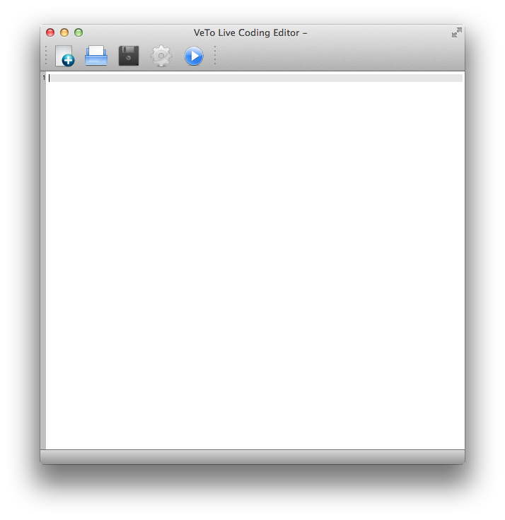
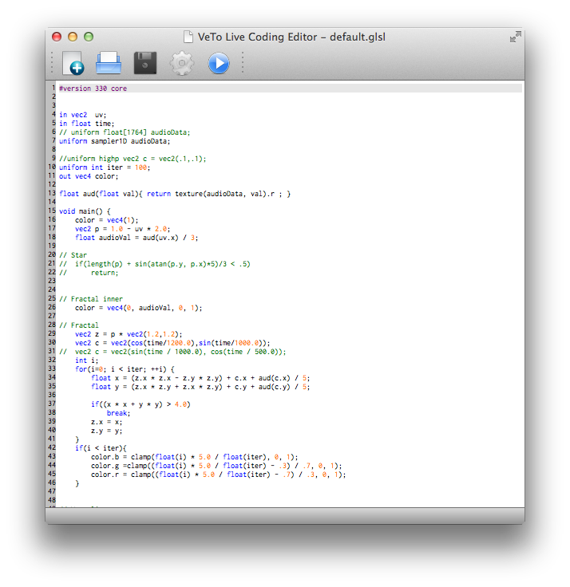
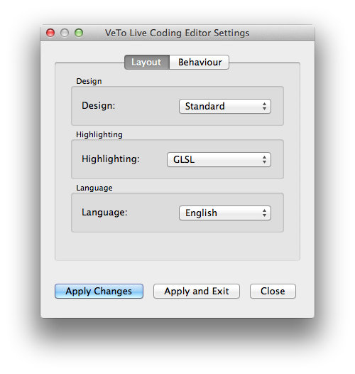
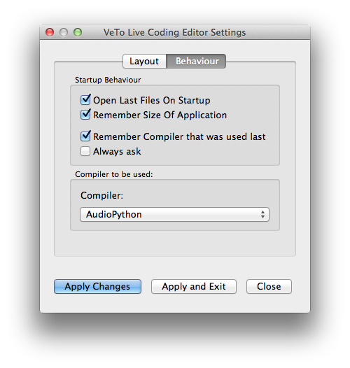

Veto-LiveCoding
===============

A Live Coding Environment for AudioPython, QML and GLSL(also rudimentary Python IDE capabilities) in QT/C++.
Should be platform independent but GLSL is only working in Windows right now; in order to get AudioPython
to work, you will install that as well(naturally). No additional Python packages are required.

Table of Contents
-----------------
**[Maintainers](#maintainers)**  
**[Version & General Info](#version--general-infos)**  
**[Compilation](#compilation)**  
**[Usage](#usage)**  
**[Settings](#settings)**  
**[Capabilities](#capabilities)**  
**[Examples & Resources](#examples--resources)**  
**[Contribute](#contribute)**  

Maintainers
-----------

* Tobias Brosge (<s0539713@htw-berlin.de>)
* Veit Heller (<s0539501@htw-berlin.de>, <veit.heller@htw-berlin.de>)

Version & General Infos
-----------------------

Package Version:    `0.1.0 Alpha/Test`

Packages used to develop this application(and their versions):

    Qt:     5.2/5.3 (QT 5 is necessary)
    Python: 2.7 (Python 3.x support is experimental and not really working, sorry for that)

Compilation
-----------

There is two ways to compile the project: with or without Python support. Per default, Python
is disabled. If you want to keep it that way, just run your normal `qmake`/`make`toolchain.
If you want to enable Python, you will have to provide a few extra arguments and the final
command chain will look like this

```
qmake -CONFIG+=with_python QMAKE_CXXFLAGS+=-DWITH_PYTHON
make CPP_FLAGS+="-DWITH_PYTHON"
```

You will notice redundance here, this is because the MOC is dumb and I do not know of any
more elegant ways to cope with that.

Anyway, this will enable Python 2.7 support for you. I do not provide any guarantees for 
Python 3.x just yet.

**Additional info:**
Please note that there are actually three ways to compile the project. There is an option
called with_python_custom where you will have to provide any additional config flags yourself.
You can try it out with, e.g.:

```
qmake -CONFIG+=with_python_custom QMAKE_CXXFLAGS+=-DWITH_PYTHON \
    QMAKE_CXX_FLAGS+=`/usr/bin/python2.7-config --clfags` \
    QMAKE_LFLAGS+=`/usr/bin/python2.7-config --ldflags`
make CPP_FLAGS+="-DWITH_PYTHON"
```

This toolchain will essentially do the same thing that the option ```with_python``` does on Unix.

Usage
-----

If you open the application for the first time, you will be greeted by an empty editor - that
will be your playground.



Default syntax highlighting will be GLSL, but you can tweak the settings to highlight Python
code as well. There are a few minor differences, but generally, I use GLSL highlighting for
Python, as it is good enough for my lazy ass(but I code in Vim, too, so I might not be the
best one for scale).



More coming soon.


Settings
--------

Settings capabilities are important for every IDE. In our editor preferences are set per-tab,
because you might want to code graphics and audio live(if you can pull that off, you are a 
genius!) and if you set them before the session, that will save an enormous amount of time.

The settings window(which can be reached by pressing the little cogwheel button) should
be pretty self-explaining, but I will explain it non-the-less.



In the first tab there are few things you can tweak regarding layout:

**Design**:
There you can adjust the editor design.

**Highlighting**:
There you can change the syntax highlighting(or even switch it off).

**Language**:
At the moment, only english and german are supported. An experimental version
of french is being created, but I do not trust my french very much. Not more than
my spanish and japanese, so all three of them will take a while.



In the second tab you can adjust the editors' behaviour to your liking:

**Startup behaviour**:
In this pane you can adjust the editors behaviour on startup. Most people will keep them
as they are, I guess, but if you want to start everything from scratch every time, you might
toggle all of them.

**Compiler**:
This is the most important part of the settings window. There you are able to change the 
compiler/interpreter that is used for your code.

Capabilities
------------

Coming soon.

Examples & Resources
--------------------

Coming soon.

Contribute
----------

Coming soon.
