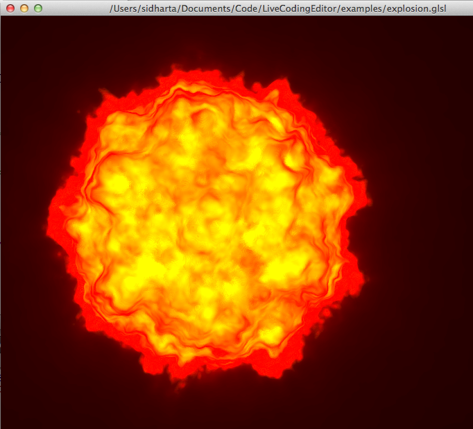
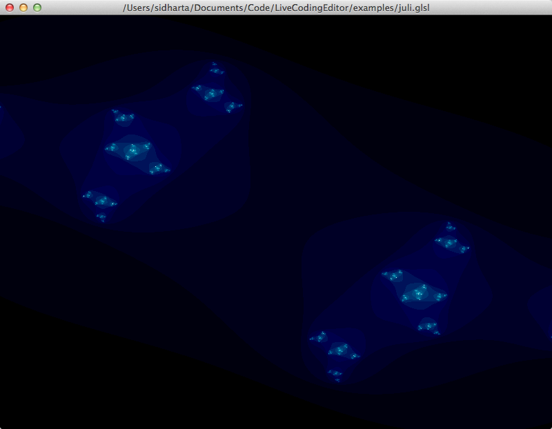

VetoLC
======


<!--[](https://travis-ci.org/hellerve/VetoLC)-->

A Live Coding Environment for AudioPython, QML and GLSL(also rudimentary Python IDE capabilities) in QT/C++.
In order to get VetoLC to compile from source, you will have to install QT as well(naturally). If you want
to use AudioPython, you will have to install that as well(link to the repository down in 
[Capabilities](#capabilities)). The editor is platform-independent.

Table of Contents
-----------------
1. **[Maintainers](#maintainers)**
2. **[Capabilities](#capabilities)**
3. **[Compilation](#compilation)**
4. **[Usage](#usage)**
5. **[Settings](#settings)**
6. **[Examples & Resources](#examples--resources)**
7. **[Contribute](#contribute)**

Maintainers
-----------

* Tobias Brosge (<s0539713@htw-berlin.de>)
* Veit Heller (<s0539501@htw-berlin.de>, <veit.heller@htw-berlin.de>)

Capabilities
------------

As stated above, this repo implements a live coding environment for a few languages in QT.
Supported languages are GLSL(Fragment Shader), AudioPython and QML. Also, it can pose as
a Python interpreter - with very limited features though.

**GLSL**:

GLSL(OpenGL Shading Language) is a programming language to execute code directly on the 
graphics processor. This code is known as shaders. In our environment only so called fragment
shaders can be programmed to make live coding easy and fast, without needing to write heaps of 
code. Those fragment shaders are then rendered in a window which you can adjust to your liking,
e.g. display it fullscreen on a beamer.

**AudioPython**:

[AudioPython](https://github.com/hellerve/AudioPython) is an audio programming library for Python,
which brings basic audio programming capabilities to Python and lets the data generated by the code
be encoded to .wav files live. This is where the fun starts: You only need to code what you would
like to hear(say, a sine wave, a drumbeat or a hammond organ with delay) and the Editor, armed with
AudioPython will do the rest.

NOTE: You need a Python-inclusive build for that. Look [here](#compilation) for further infos on that
matter.

**QML**:

QML(QT Markup Language) is a declarative programming language, based on JSON, by Qt. It is mostly
used for quick UI generation, but can be used and abused, e.g. for multimedia. That is what we did
here.

NOTE: The support for this is a stub and will need a few weeks to work as expected so it is 
disabled right now.

**Python (Regular)**:

Since it did not include big effort and we already had the Python interpreter up and running, we 
decided to include a vanilla version as well. It is very basic, though, and does not have the 
capabilites most people want to have in their IDE(Execption tracebacks, interactive command line,
debugger et cetera).
Most of those features are not suited for a live environment and are excluded by will.
You can have fun with the environment, though(well, we know we had).

Compilation
-----------

There is two ways to compile the project: with or without Python support. Per default, Python
is disabled. If you want to keep it that way, just run your normal `qmake`/`make`toolchain or
use the default makefile included in the top directory of the project(`make all` or `make app` -
the former will also create the tests). If you want to enable Python, either call `make python`
(for Python 2.7 use `make python2`) or you will have to provide a few extra arguments and the final 
command chain will look like this

```
qmake CONFIG+=with_python QMAKE_CXXFLAGS+=-DWITH_PYTHON
make CPPFLAGS+="-DWITH_PYTHON"
```

You will notice redundance here, this is because the MOC is dumb and we do not know of any
more elegant ways to cope with that. This will install your default Python version. In other words,
if that is Python 2.7, it will do the same thing as `make python2.7`.

At the moment there is no build for Python 3 specifically.

**Additional info:**
Please note that there are actually three ways to compile the project. There is an option
called with_python_custom where you will have to provide any additional config flags yourself.
You can try it out with, e.g.:

```
qmake CONFIG+=with_python_custom QMAKE_CXXFLAGS+=-DWITH_PYTHON \
    QMAKE_CXX_FLAGS+=`/usr/bin/python2.7-config --clfags` \
    QMAKE_LFLAGS+=`/usr/bin/python2.7-config --ldflags`
make CPPFLAGS+="-DWITH_PYTHON"
```

This toolchain will essentially do the same thing that the option ```with_python2``` does on Unix.
This option is only available for handmade builds, our Makefile cannot handle that at the moment.

Please note that if you have a custom command to invoke qmake(Qt 5.1 or later is required, so it
might be possible that you use a command like `qmake5`if you have both Qt5.x and Qt4.x), you can
do that by using the `QMAKE` variable like so:

```
qmake foo QMAKE=/path/to/qmake
```

You can have a look at the .travis.yml to get a slight idea of how your build process could look like.

Usage
-----

If you open the application for the first time, you will be greeted by an empty editor - that
will be your playground.


Default syntax highlighting will be GLSL, but you can tweak the settings to highlight Python
code as well. There are a few minor differences, but generally, we use GLSL highlighting for
Python, as it is good enough for our lazy asses(but we code in Vim, too, so we might not be the
best users for scale).


You might want to take a ride and you can(on every platform we know of, provided there is OpenGL
and GLSL installed). There are examples for Graphics and Audio Live Coding within the `examples`
directory; the audio examples are rather basic, while the graphics files are partially very advanced. 
The glsl files are mostly from [the glsl playground](https://glsl.heroku.com). Check it out, it's 
awesome! Some of the sound examples are ported from javascript and the ideas are from 
[wavepot](https://wavepot.com), check that out as well; we're a bit jealous of both projects, because
they are browser-based and hip and all, but we still like to use desktop apps(old-fashioned, huh?).
If you open and run them, you can play around with it very well(run it by hitting the systems refresh 
action(`F5` on Windows and Linux, `Cmd+R` on OS X)). If you are doing graphics, a new window 
will pop open that renders the shader, concerning audio there will be sound playing. 
Our personal preference is to drag rendering windows to a different screen so you have a clean 
workbench. If you change something, you can hit refresh at every point in your development and the 
updated code will be run. If it does not compile, a message will tell you so(either as a popup or
as an exception in the bottom part of the editor).



If you want to test out the Python capabilities, go to the Settings(for a tutorial on Settings 
in our environment refer to [this](#settings) section) and choose "Python (Regular)" as compiler.
Now you can write and interpret Python code, yay!



That is not too interesting, though, you might want to use Python in the context of Audio Live
Coding, as promised earlier. You can do that, too! Just go back to the Settings and select "Audio
Python" in the compiler section. For a general tutorial/introduction to AudioPython, refer to 
[this](https://github.com/hellerve/AudioPython) page.

If you want to play with QML, I have bad news for you, though. This feature is not yet ready. :(

That's it with the basics. Have fun!

Settings
--------

Settings capabilities are important for every IDE. In our editor preferences are set per-tab,
because you might want to code graphics and audio live(if you can pull that off, you are a 
genius!) and if you set them before the session, that will save an enormous amount of time.

The settings window(which can be reached by pressing the little cogwheel button) should
be pretty self-explaining, but we will explain it non-the-less.


In the first tab there are few things you can tweak regarding layout:

**Design**:

There you can adjust the editor design. It is based on the styles that are available by
default from QT(mostly Windows and Fusion, but on certain platforms also other designs,
e.g. Mac or KDE).

**Highlighting**:

There you can change the syntax highlighting(or even switch it off).

**Language**:

At the moment, only english and german are supported. An experimental version
of french is being created, but we do not trust our french very much. Not more than
our spanish and japanese, so all three of them will take a while.


In the second tab you can adjust the editors' behaviour to your liking:

**Startup behaviour**:

In this pane you can adjust the editors behaviour on startup. Most people will keep them
as they are, I guess, but if you want to start everything from scratch every time, you might
toggle all of them.

**Compiler**:

This is the most important part of the settings window. There you are able to change the 
compiler/interpreter that is used for your code.

Examples & Resources
--------------------

Examples are located in the `examples` dir.

**For developers:**

If you want to help making the editor better, there is a `doc` directory that contains the
autogenerated documentation created by doxygen. Also, there is a [repository](https://github.com/hellerve/LC-Doc)
that contains a paper we wrote about this project.

Contribute
----------

At the time being, most issues are in integrating the interpreters/compilers. We are working
on making the AudioPython interpreter more stable. QML is up next.

If you want a interpreter/compiler that's not on the list, feel free to contact us. We
will brief you on how to best approach that and integrate your code as good as possible.

If you want to contribute and do not know what to do, have a look at the issues.
